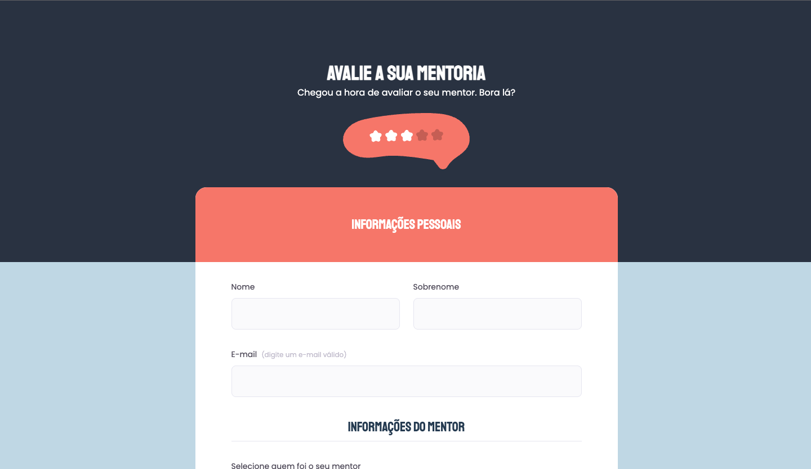

# Stage 03 - Challenge 02

**Projeto desenvolvido no nível 03 do programa de formação Explorer da Rocketseat.**

## 📝 **Conceitos trabalhados**

**Formulários:**

- Introdução aos métodos de transferência de dados (GET e POST);
- Construção de formulários em HTML;
- Tags de agrupamento (fieldset e legend);
- Contrução de checkbox customizado e acessível;
- Validação de campos e submissão do formulário.

#### 👉🏽 Clique **[aqui](https://eduardofariasdev.github.io/stage03-challenge02/)** e abra esse projeto no seu seu navegador.
